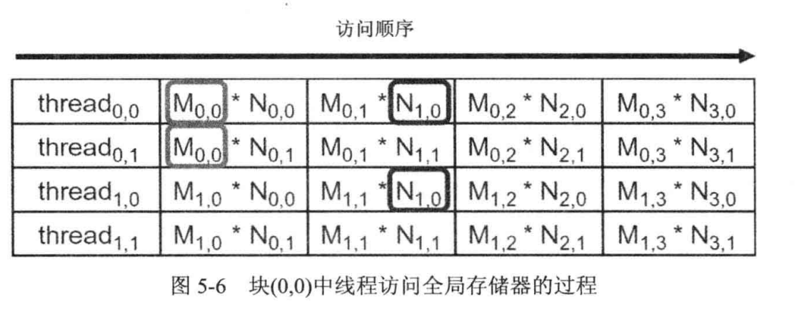

# CUDA 存储器
## 5.1
无法使用共享内存来对 3.1 题进行优化，因为矩阵加法过程中，数据只计算一次。无法进行复用。

## 5.2

图片5.6如下所示：

首先若不进行分块，那么我们需要读取 $8(每个数据将被读取8次)*8(行)*8(列)*2(两个矩阵)=1024$ 次 DRAM。倘若分为2x2 的 block 并利用shared memory进行存储，那么，读取 DRAM 次数变成 $4(每个block读取DRAM次数)*4(行)*4(列)*4(被加载次数)*2(两个矩阵)=512$，如果为 4x4 的矩阵块，读取的次数为 $16(每个 block 读取次数) * 2(row)* 2(col)*2(times)*2(matrix\ num)=256$。呈现出正比关系。

## 5.3

可能会出现计算错误的现象，即在某次计算的时候，矩阵上的数据并未加载到 shared memory 上，从而导致计算错误。

## 5.4

1. 访问 shared memory 的速度要比直接存取 DRAM 中的数据要快。
2. 读取 DRAM 有带宽限制，文章中带宽限制 40 GB/s，因此不能充分的使用 GPU 的计算资源。

## 5.5

c (和 5.2 题一样思路)

## 5.6

d $512*1000$

## 5.7

b

## 5.8

在每组 SM 阵列当中，均设计了一定容量的片上存储器。该存储器由共享缓存和L1缓存构成。L1 缓存用来缓存从 DRAM 到 SM 的数据。而 shared memory 的数据由代码指定，来共享了不同 threads 之间的数据。shared memory 能够为明确界定存储器存取的算法提升存储器存取速度；而 L1 缓存则能够为剩下那些不规则的算法提升存储器存取速度，并且在这些不规则算法中，事先并不知道数据地址。

## 5.9
1. $N(每个数据读取次数)*N(Row)*N(Col)*2(两个矩阵)=2 * N^3$
2. $2*T*{\lceil {N \over T} \rceil}^2$

## 5.10
全局存储器访问操作 32 字长=32bit=4byte,单个线程的读取数据量$4byte * 7=28 byte$，单个线程完成 36 次浮点计算，从而我们可以得到 $CGMA={36 \over 7}=5.1428571429 \approx 5$。
1. 对于 a 来说，峰值带宽为 100 GB/s，即加载速度不会超过${100GB/s\over 4}=25gflops$，又因为此题的 CGMA 为 5，那么该 kernal 峰值性能在 $5*25Gflops=125gflops$ ，小于硬件的峰值性能($200gflops$)，因此是访存密集型。

2. 对于 b 来说，加载速度不超过 ${250 GB/s \over 4}=62.5gflops$，和上题相同可以推出该计算 kernal 的峰值为${62.5gflops * 5=312.5gflops}$，大于硬件的峰值($300gflops$)，因此属于计算密集型。

## 5.11

> 主要思路与书本 P99 页中间两段有关。有没有可能题中关于 shared memory 的大小写错了?英文版也是这种设定。

书中描写了GT200算力为1.2，$shared\ memory = 16KB$，每个 SM 可以支持 1024 线程，算力为1的情况下，我们假设 shared memory 与 GT200 相同，但是 SM 可以支持 512 线程:
1. $4*128=512$ 符合 SM 不大于 512 个线程的限制。$32 B * 4=128 B$ 应该是满足需求的。
2. $8*128=1024$ 不符合 SM 总线程不大于 512 的限制。$16 B * 8=128 B$ 应该是满足需求的。
3. $16*32=512$ 符合 SM 不大于 512 个线程的限制。$16*64 B=1024 B$应该是满足需求的。
4. $2*512=1024$ 符合 GT200 的限制，$2*32B=64B$ 符合。
4. $4*256=1024$ 符合 GT200 的限制，$4*16B=64B$ 符合。
4. $8*256=2024$ 符合 GT200 的限制，$8*8B=64B$ 符合。