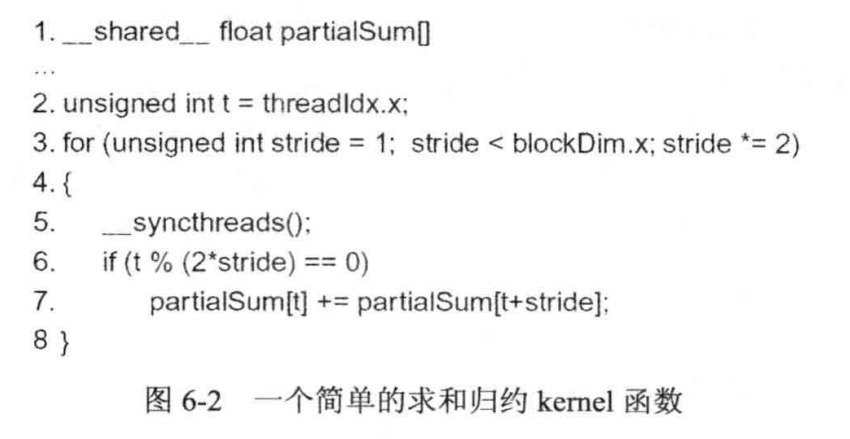
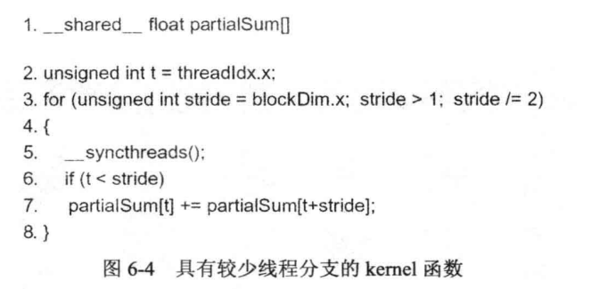

# 性能优化

> 有个 [ZhiHuer](https://www.zhihu.com/people/ban-zhuan-yuan-shi-chao-ji-gun/posts) 关于 [规约算法](https://zhuanlan.zhihu.com/p/426978026) 和 [GEMM 优化](https://zhuanlan.zhihu.com/p/435908830)写的很好。

## 规约
### 6.1 
**图6.2**


**图6.4**



这个题目的主要意图在于减少线程浪费，每次我们都将面临一半的线程空闲。所以，对于当前这个题目，更好的优化方法，在初次取数后，先做一次加法。当然，我们需要的更改 block 数量为原来的 1/2，每个 block 中 thread 数量则需要加倍。


```c++
__shared__ float partialSum[THREAD_PER_BLOCK];
unsigned int i=blockIdx.x*(blockDim.x*2)+threadIdx.x;
unsigned int t=threadIdx.x;
paartialSum[t]=d_in[i] + d_in[i+blockDim.x];
__syncthreads();
for(unsigned int stride=blockDim.x/2;stride>1;stride/=2){
    __syncthreads();
    if(t<stride)
        partialSum[t]+=partialSum[t+stride];
}

```

### 6.2

上述 6.1 的方法，引入的计算仅仅是在从DRAM加载到 shared memory 这一段上面。

### 6.3

```c++
__global__ void reduce(float *d_in,float *d_out){
    unsigned int i=blockIdx.x*(blockDim.x*2)+threadIdx.x;
    unsigned int t=threadIdx.x;
    paartialSum[t]=d_in[i] + d_in[i+blockDim.x];
    __syncthreads();
    for(unsigned int stride=blockDim.x/2;stride>1;stride/=2){
        if(t<stride)
            partialSum[t]+=partialSum[t+stride];
        __syncthreads();
    }
    if(tid==0)d_out[blockIdx.x]=sdata[tid];
}
```

### 6.4

* [代码和答案](./ans6.4/)

### 6.8

简单规约应当是图6-2的写法，此时，Wrap数为 d(32),分支跳转为 b(1)。

### 6.9

## 矩阵乘

### 6.5

### 6.6

### 6.7

### 6.10


## 其他
### 6.11
### 6.12
### 6.13