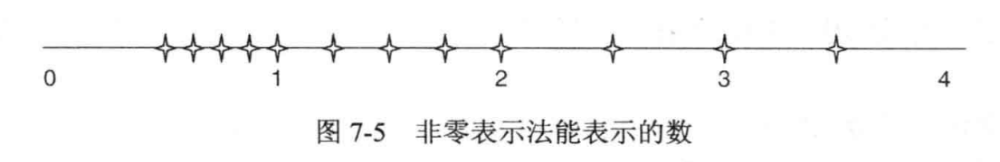
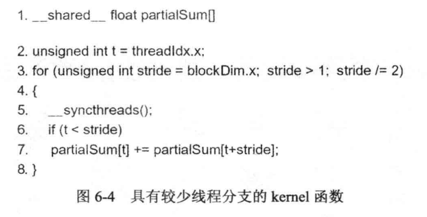

# 浮点运算
## 7.1

|E|M|非零(S >0 )|
|:---:|:---:|:---:|
|00|000|$2^{-1}$|
|00|001|$2^{-1}+1*2^{-4}$|
|00|010|$2^{-1}+2*2^{-4}$|
|00|011|$2^{-1}+3*2^{-4}$|
|00|100|$2^{-1}+4*2^{-4}$|
|00|101|$2^{-1}+5*2^{-4}$|
|00|110|$2^{-1}+6*2^{-4}$|
|00|111|$2^{-1}+7*2^{-4}$|
|01|000|$2^{0}$|
|01|001|$2^{0}+1*2^{-4}$|
|01|010|$2^{0}+2*2^{-4}$|
|01|011|$2^{0}+3*2^{-4}$|
|01|100|$2^{0}+4*2^{-4}$|
|01|101|$2^{0}+5*2^{-4}$|
|01|110|$2^{0}+6*2^{-4}$|
|01|111|$2^{0}+7*2^{-4}$|
|10|000|$2^{1}$|
|10|001|$2^{1}+1*2^{-4}$|
|10|010|$2^{1}+2*2^{-4}$|
|10|011|$2^{1}+3*2^{-4}$|
|10|100|$2^{1}+4*2^{-4}$|
|10|101|$2^{1}+5*2^{-4}$|
|10|110|$2^{1}+6*2^{-4}$|
|10|111|$2^{1}+7*2^{-4}$|

根据上面表格做出图即可

## 7.2

|E|M|非零(S >0 )|
|:---:|:---:|:---:|
|000|00|$2^{-3}$|
|000|01|$2^{-3}+1*2^{-3}$|
|000|10|$2^{-3}+2*2^{-3}$|
|000|11|$2^{-3}+3*2^{-3}$|
|001|00|$2^{-2}$|
|001|01|$2^{-2}+1*2^{-3}$|
|001|10|$2^{-2}+2*2^{-3}$|
|001|11|$2^{-2}+3*2^{-3}$|
|010|00|$2^{-1}+7*2^{-3}$|
|010|01|$2^{-1}+1*2^{-3}$|
|010|10|$2^{-1}+2*2^{-3}$|
|010|11|$2^{-1}+3*2^{-3}$|
|011|00|$2^{0}$|
|011|01|$2^{0}+1*2^{-3}$|
|011|10|$2^{0}+2*2^{-3}$|
|011|11|$2^{0}+3*2^{-3}$|
|100|00|$2^{1}$|
|100|01|$2^{1}+1*2^{-3}$|
|100|10|$2^{1}+2*2^{-3}$|
|100|11|$2^{1}+3*2^{-3}$|
|101|00|$2^{2}$|
|101|01|$2^{2}+1*2^{-3}$|
|101|10|$2^{2}+2*2^{-3}$|
|101|11|$2^{3}+3*2^{-3}$|
|110|00|$2^{3}$|
|110|01|$2^{3}+1*2^{-3}$|
|110|10|$2^{3}+2*2^{-3}$|
|110|11|$2^{3}+3*2^{-3}$|

## 7.3

 0.5ULP(这个答案并不确定，我的理解是和书本135页所描述的一致)。

## 7.4

使用上图的规约方式，可能会导致一个很小的值同一个大值相加的情况，从而小值有可能将被“消失”。(参照书中7.5节的介绍)

## 7.5

单精度浮点位数为32位，其中1个符号位，8个阶码，23个尾数位。由题目可得共迭代9次，每次可以确定2位，运算结束可以确定18位。其中，有一位是隐藏的，那么也就是从确定了17位尾数，23-17=6，也就是有6位没有确定，假设这六位都为 1，那么$ULP={2^6}=64$