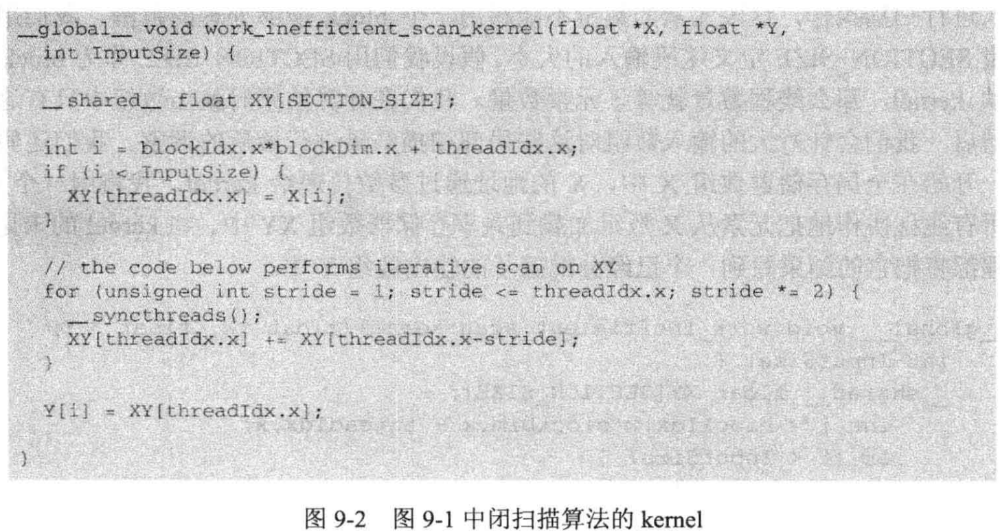
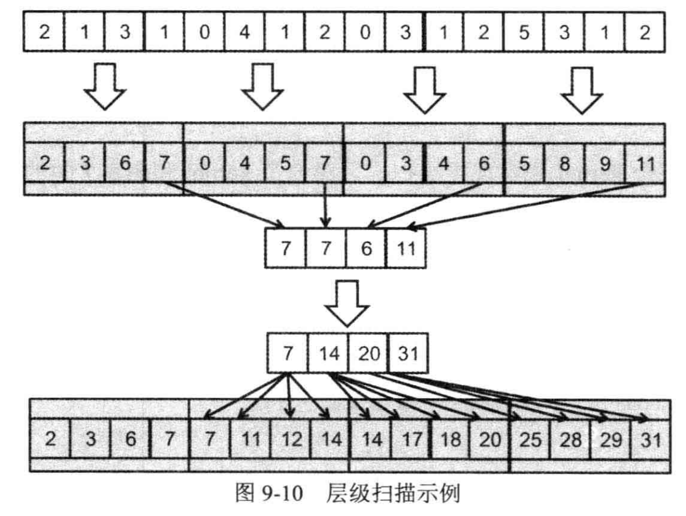

# 并行模式：前缀和
## 1



根据代码可得，跨步值为1、2、4、8、16小于 wrap 值会产生控制流分支。当继续运行时跨步值会大于等于 wrap 值的倍数，从而不会再产生分支。


## 2

a(书中的第170页有较为详细的推导过程)

## 3

d(这题按照我的理解是当使用简单方法进行计算的复杂度，书中第169页有过详细描述。)

## 4

根据图 9.2 进行修改，这里只需要将赋值 shared memory 语句做修改即可：

```c++
_global__ void Kogge_Stone_scan_kernel(float *X, float *Y, int InputSize) 
{ 
     __shared__ float XY[SECTION_SIZE]; 
    int i = blockIdx.x * blockDim.x + threadIdx.x; 
    if (i < InputSize && threadIdx.x != 0) { 
        XY[threadIdx.x] = X[i - 1]; 
    } 
    else { 
        XY[threadIdx.x] = 0; 
    } 
    if (threadIdx.x < InputSize) 
     { 
        for (unsigned int stride = 1; stride < blockDim.x; stride *= 2) { 
            if (threadIdx.x >= stride) { 
            __syncthreads(); 
                XY[threadIdx.x] += XY[threadIdx.x - stride]; 
            } 
        } 
        Y[i] = XY[threadIdx.x]; 
     } 
}
```

## 5

第一个 kernel 和高效 kernel 写法相同，就是再最后需要额外维护一个数组存储值，第 2 个kernel 将额外维护的数组进行规约操作，最后将额外维护数据的值分别加到不同的块中。整个流程和图 9-10 相同。



[代码](./ans9.5/HierarchicalParallelScan.cu)

## 6

有$NSB*（{N \over SSB}*log {N \over SSB}）+NSB log{NSB}+NSB*{NSB \over SSB}-3$，即大约不超过4*N-3（其中NSB=块的数量，SSB=块的大小)

## 7

这个题目的中文翻译有问题，这里采用英文原文版本作答：
1. [4 6 7 1 2 8 5 2]
1. [4 10 13 8 3 10 13 7]
1. [4 10 17 18 16 18 16 17]
3. [4 10 17 18 20 28 33 35]

## 8

* [ 4 10 7 8 2 10 5 7 ]
* [ 4 10 7 18 2 28 5 35 ]
* [ 4 10 17 18 20 28 33 35 ]

## 9

GTX 690 算力为 3 ，比剩下两款的算力都高。